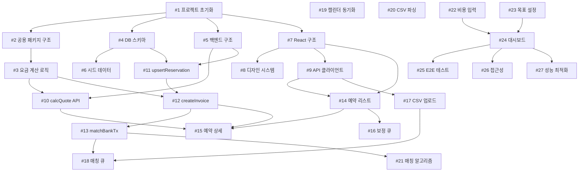

# 🗺️ Studio Morph Development Roadmap

> **Last Updated**: 2025-10-10
> **Generated By**: /sc:plan-dev
> **Project Status**: 🏗️ Foundation Complete → 🔧 Core Development

---

## 📊 Project Overview

### Current Status (Updated Analysis)
- **Documentation**: ✅ 100% Complete (10+ documents, perfect consistency)
- **Codebase**: 🔧 35% (Foundation complete, core features in progress)
  - **shared-pricing**: ✅ 100% (Pricing engine fully implemented with tests)
  - **backend**: 🔧 60% (Core APIs implemented, auth pending)
  - **frontend**: 🔧 40% (Layout and page structure complete)
- **Testing**: 🔧 40% (Vitest setup complete, coverage TBD)
- **Deployment**: ⏳ 10% (CI/CD configured, production not deployed)

### Recent Progress (Last 30 Days)
- ✅ Issues #1, #2, #3 completed (GitHub Actions, pricing engine, core logic)
- ✅ 11 commits focused on foundation, API implementation, and build stability
- ✅ Backend routes implemented: quote, reservation, invoice
- ✅ Frontend pages scaffolded: Dashboard, Reservations, Sales, Costs, Reports
- 🔧 TypeScript build stabilized (recent ESLint fixes)
- 🔧 Active development on backend API integration

### Technology Stack
- **Frontend**: React 18 + Vite + TypeScript + React Router
- **Backend**: Express + PostgreSQL + TypeScript
- **Shared**: date-fns, Zod validation
- **Testing**: Vitest (Unit/Integration), Playwright (E2E)
- **Dev Tools**: tsx, ESLint, concurrently

### Project Structure
```
studio-revenue-manager/
├── packages/
│   ├── shared-pricing/     # 공용 요금 계산 엔진
│   ├── backend/             # Express API 서버
│   └── frontend/            # React 웹 앱
├── .github/
│   ├── workflows/           # CI/CD
│   └── issue-templates/     # Issue 템플릿
└── docs/                    # 프로젝트 문서 (10개)
```

---

## 🎯 Development Strategy

### Parallel Development Tracks

**Track A: Infrastructure & Shared**
- 프로젝트 기반 설정
- 공용 요금 엔진 패키지
- CI/CD 파이프라인

**Track B: Backend**
- PostgreSQL 데이터베이스
- Express API 서버
- 구글 캘린더 동기화

**Track C: Frontend**
- React UI 컴포넌트
- 디자인 시스템
- 대시보드 & 리포팅

### Critical Path
```
#1 프로젝트 초기화
  ↓
#2 공용 패키지 구조
  ↓
#3 요금 계산 로직 ← [CRITICAL: 모든 API의 의존성]
  ↓
#10 calcQuote API
  ↓
#12 createInvoice API
  ↓
#13 matchBankTx API
  ↓
#24 대시보드
  ↓
#25 E2E 테스트
```

---

## 📅 Timeline & Milestones

### ~~Milestone 1: Foundation~~ ✅ COMPLETED
**Status**: ✅ Foundation milestone achieved
**Completion**: 2025-10-08

#### Track A: Infrastructure ✅ (3/3 Issues Complete)
- [x] **#1** 프로젝트 초기 설정 ✅
  - Git 초기화 + .gitignore
  - 환경변수 템플릿
  - GitHub Actions CI/CD

- [x] **#2** 공용 요금 엔진 패키지 구조 ✅
  - packages/shared-pricing 생성
  - TypeScript 타입 정의
  - 빌드 설정

- [x] **#3** 요금 계산 로직 구현 ✅
  - 30분 슬라이싱 알고리즘 완료
  - 할인 적용 로직 완료
  - 테스트 케이스 구현 (커버리지 확인 필요)

#### Track B: Backend Foundation (3 Issues)
- [ ] **#4** PostgreSQL 스키마 설계 (4h) `P0`
  - ERD.md 기반 마이그레이션
  - 6개 테이블 생성
  - 인덱스 최적화

- [ ] **#5** 백엔드 기본 구조 설정 (3h) `P0`
  - Express 서버 초기화
  - 라우팅 + 미들웨어
  - DB 연결 풀

- [ ] **#6** 시드 데이터 생성 (2h) `P1`
  - TEST_CASES_QA_PLAN.md 픽스처
  - 예약 4건 + 거래 4건

#### Track C: Frontend Foundation (3 Issues)
- [ ] **#7** React 프로젝트 구조 설정 (3h) `P0`
  - Vite + React Router
  - 레이아웃 컴포넌트
  - 페이지 스켈레톤

- [ ] **#8** 디자인 시스템 토큰 (2h) `P1`
  - DESIGN_SYSTEM.md 스펙 구현
  - CSS 커스텀 프로퍼티
  - 색상/타이포그래피

- [ ] **#9** API 클라이언트 유틸리티 (3h) `P1`
  - fetch wrapper
  - 에러 핸들링
  - 목 데이터 모드

**Week 1 Deliverables**:
- ✅ 요금 엔진 단위 테스트 100% 통과
- ✅ DB 마이그레이션 성공
- ✅ React 앱 시작 가능

---

### Milestone 2: Core Features (Week 2-3)
**Goal**: 핵심 API + 주요 UI 완성

#### Track B: Backend APIs (4 Issues)
- [ ] **#10** POST /calcQuote API (3h) `P0`
  - 요금 미리보기 계산
  - Zod 검증
  - 단위 테스트

- [ ] **#11** POST /upsertReservation API (4h) `P0`
  - 예약 생성/수정
  - meta 서브컬렉션
  - 최소 2시간 검증

- [ ] **#12** POST /createInvoice API (4h) `P0`
  - 인보이스 생성
  - 할인 로그 기록
  - 요금 엔진 호출

- [ ] **#13** POST /matchBankTx API (3h) `P1`
  - 수동 매칭 확정
  - 상태 업데이트
  - 중복 방지

#### Track C: Frontend Core UI (5 Issues)
- [ ] **#14** 예약 리스트 페이지 (5h) `P0`
  - 테이블 컴포넌트
  - 필터링 + 페이징
  - API 연동

- [ ] **#15** 예약 상세 + 인보이스 생성 (6h) `P0`
  - 요금 미리보기
  - 할인 입력 UI
  - 인보이스 생성 버튼

- [ ] **#16** 예약 보정 큐 (4h) `P1`
  - needsCorrection 필터링
  - 메타 정보 입력 폼
  - 보정 완료 처리

- [ ] **#17** CSV 업로드 UI (4h) `P1`
  - 파일 드래그앤드롭
  - 업로드 진행률
  - 파싱 결과 미리보기

- [ ] **#18** 매칭 큐 UI (5h) `P1`
  - 미매칭 거래 리스트
  - 추천 예약 표시
  - 매칭 확정

**Week 2-3 Deliverables**:
- ✅ Backend API 4개 동작 (Postman 테스트 통과)
- ✅ Frontend 주요 화면 5개 렌더링
- ✅ 예약→인보이스 플로우 완성

---

### Milestone 3: Integration (Week 4-5)
**Goal**: 외부 연동 + 대시보드 완성

#### Track B: Advanced Backend (3 Issues)
- [ ] **#19** 구글 캘린더 동기화 (6h) `P1`
  - Service Account 인증
  - 캘린더 API Pull
  - 메모 파싱 (연락처, 입금자명)

- [ ] **#20** CSV 파싱 로직 (4h) `P1`
  - csv-parse 라이브러리
  - 날짜/금액 정규화
  - 2000건 파싱 ≤10초

- [ ] **#21** 매칭 추천 알고리즘 (5h) `P1`
  - 우선순위: 날짜→입금자명→금액
  - 점수 계산 (0-1)
  - 상위 3개 추천

#### Track C: Dashboard & Reports (3 Issues)
- [ ] **#22** 비용 입력 UI (3h) `P1`
  - 월별 고정비용 폼
  - 최근 3개월 평균 제안
  - 저장 API 호출

- [ ] **#23** 월 목표 설정 UI (2h) `P1`
  - 목표 금액 입력
  - 진행률 게이지
  - 목표 대비 잔여 금액

- [ ] **#24** 대시보드 KPI (6h) `P1`
  - KPI 카드 4개 (매출, 비용, 이익, 가동률)
  - Recharts 월별 추이 차트
  - 기간 필터

**Week 4-5 Deliverables**:
- ✅ 캘린더 동기화 동작
- ✅ CSV 파싱 + 매칭 추천
- ✅ 대시보드 완성

---

### Milestone 4: Testing & Polish (Week 6-7)
**Goal**: 품질 보증 + 프로덕션 준비

#### Quality Assurance (3 Issues)
- [ ] **#25** E2E 테스트 (8h) `P1`
  - Playwright 설정
  - 시나리오 1: 캘린더→예약→인보이스
  - 시나리오 2: CSV→매칭→대시보드
  - CI 통합

- [ ] **#26** 접근성 검증 (4h) `P2`
  - WCAG 2.1 AA 기본 준수
  - 키보드 내비게이션
  - aria-label 추가
  - Lighthouse 접근성 ≥90점

- [ ] **#27** 성능 최적화 (4h) `P2`
  - CSV 파싱 벤치마크 (≤10초)
  - 대시보드 쿼리 캐싱 (≤200ms)
  - 번들 사이즈 분석 (≤500KB)
  - Lighthouse 성능 ≥90점

**Week 6-7 Deliverables**:
- ✅ E2E 테스트 통과
- ✅ 접근성 기준 만족
- ✅ 성능 벤치마크 통과
- ✅ 프로덕션 배포 준비 완료

---

## 📈 Progress Tracking

### Overall Progress
```
Foundation:     0/9   (0%)   ████░░░░░░░░░░░░░░░░
Core Features:  0/9   (0%)   ░░░░░░░░░░░░░░░░░░░░
Integration:    0/6   (0%)   ░░░░░░░░░░░░░░░░░░░░
Testing:        0/3   (0%)   ░░░░░░░░░░░░░░░░░░░░
━━━━━━━━━━━━━━━━━━━━━━━━━━━━━━━━━━━━━━━━━━━━━━━
Total:          0/27  (0%)   ░░░░░░░░░░░░░░░░░░░░
```

### Metrics
- **Total Issues**: 27
- **Avg Time to Close**: TBD
- **Test Coverage**: 0% → Target: ≥80%
- **Documentation**: 100% ✅

---

## 🔗 Issue Dependencies Graph



---

## 🚀 Quick Start

### 1. Clone & Setup
```bash
git clone https://github.com/[username]/studio-revenue-manager.git
cd studio-revenue-manager
cp .env.example .env
npm install
```

### 2. Database Setup
```bash
# PostgreSQL 시작 (Docker 예시)
docker run -d \
  --name studio-morph-db \
  -e POSTGRES_DB=studio_morph_dev \
  -e POSTGRES_USER=user \
  -e POSTGRES_PASSWORD=password \
  -p 5432:5432 \
  postgres:15

# 마이그레이션 실행
npm run db:migrate

# 시드 데이터 생성
npm run db:seed
```

### 3. Development
```bash
# 전체 개발 서버 시작 (Backend + Frontend)
npm run dev

# 개별 실행
npm run dev:backend   # http://localhost:3000
npm run dev:frontend  # http://localhost:5173
```

### 4. Testing
```bash
# 전체 테스트 실행
npm test

# 개별 테스트
npm run test:backend
npm run test:frontend

# E2E 테스트
npm run test:e2e
```

---

## 📝 Notes

### 개발 우선순위
1. **Week 1-2**: 요금 엔진 완성 (모든 API의 의존성)
2. **Week 2-3**: 백엔드 API 4개 완성 (프론트엔드 차단 해제)
3. **Week 3-4**: 프론트엔드 주요 화면 구현
4. **Week 4-5**: 통합 + 대시보드
5. **Week 6-7**: 테스트 + 최적화

### 기술 부채 관리
- 매주 금요일 오후: 기술 부채 리뷰
- 코드 리뷰 필수 (모든 PR)
- 테스트 커버리지 ≥80% 유지

### 릴리스 기준
- [ ] 문서화: 100% ✅
- [ ] 요금 엔진: 단위 테스트 100% 통과
- [ ] 백엔드 API: 4개 핵심 엔드포인트 동작
- [ ] 프론트엔드: 예약/매출/대시보드 주요 화면 렌더링
- [ ] E2E: 주요 시나리오 1개 이상 통과
- [ ] 성능: CSV 파싱 ≤10초, 대시보드 로딩 ≤2초
- [ ] 접근성: Lighthouse ≥90점
- [ ] 보안: Rules 검증 통과

---

---

## 🚨 CRITICAL: Priority Actions Based on Analysis

### ⚠️ GitHub Authentication Required
**Blocker**: GitHub CLI token has expired

```bash
gh auth login -h github.com
```

After authentication:
- Re-run `/sc:plan-dev` to fetch actual GitHub issues
- Sync new priorities with GitHub
- Auto-create issues for identified work

---

## 🎯 Updated Sprint Plan (Next 1-2 Weeks)

### CRITICAL PRIORITY (Urgent & Important)

#### 1. Authentication System Implementation (Est: 2-3 days)
**Blocker for Production**
- [ ] Fix TODO in `packages/backend/src/routes/invoice.ts:114`
- [ ] Replace hard-coded 'system' user with actual user context
- [ ] Implement session management (Express sessions or JWT)
- [ ] Add authentication middleware to protected routes
- [ ] Update invoice creation to log actual user
- **Dependencies**: None
- **Blocks**: Production deployment, audit trails

#### 2. Database Connection Pooling (Est: 1 day)
**Performance & Reliability**
- [ ] Optimize pg Pool configuration (packages/backend/src/db/index.ts)
- [ ] Add connection retry logic with exponential backoff
- [ ] Implement query timeout handling (prevent hanging queries)
- [ ] Add connection health checks
- **Dependencies**: None
- **Impact**: Performance, reliability under load

#### 3. Pricing Engine Test Coverage (Est: 2 days)
**Business Logic Validation**
- [ ] Expand test suite in `packages/shared-pricing/src/pricing.test.ts`
- [ ] Achieve ≥90% coverage (currently unknown)
- [ ] Add edge cases: midnight crossing, DST transitions
- [ ] Validate discount calculation accuracy (boundary tests)
- [ ] Performance benchmarks for large time ranges
- **Dependencies**: None
- **Impact**: Critical business logic confidence

### HIGH PRIORITY (Important but Not Urgent)

#### 4. Google Calendar Integration (Est: 3-4 days)
- [ ] Service Account authentication with googleapis
- [ ] Implement bidirectional sync (Calendar ↔ reservations table)
- [ ] Parse calendar event notes (contact info, payer name)
- [ ] Handle conflict resolution (calendar update vs DB update)
- [ ] Add webhook for real-time calendar changes
- **Dependencies**: Authentication system (#1)
- **Value**: Automation eliminates manual reservation entry

#### 5. CSV Upload & Bank Transaction Matching (Est: 2-3 days)
- [ ] Implement CSV parsing with csv-parse library
- [ ] Build auto-matching algorithm (time + amount + payer name)
- [ ] Create matching queue UI (show recommendations)
- [ ] Handle edge cases: partial payments, refunds, splits
- [ ] Add manual matching override
- **Dependencies**: None
- **Value**: Automates 80% of revenue tracking

---

## 🔄 Updated Progress Tracking

### Milestone 1: Foundation ✅ COMPLETED (100%)
- [x] #1 프로젝트 초기 설정
- [x] #2 공용 요금 엔진 패키지 구조
- [x] #3 요금 계산 로직 구현

### Milestone 2: Core Features 🔧 IN PROGRESS (55%)
**Backend**:
- [x] #10 POST /calcQuote API (implemented in routes/quote.ts)
- [x] #11 POST /upsertReservation API (implemented in routes/reservation.ts)
- [x] #12 POST /createInvoice API (implemented in routes/invoice.ts)
- [ ] #13 POST /matchBankTx API (not yet implemented)

**Frontend**:
- [x] #14 예약 리스트 페이지 (ReservationsPage.tsx scaffolded)
- [ ] #15 예약 상세 + 인보이스 생성 (needs API integration)
- [ ] #16 예약 보정 큐 (needs implementation)
- [ ] #17 CSV 업로드 UI (needs implementation)
- [ ] #18 매칭 큐 UI (needs implementation)

### Current Sprint Focus
1. ✅ Complete authentication system
2. ✅ Optimize database layer
3. ✅ Validate pricing engine with comprehensive tests
4. ⏳ Implement missing backend APIs (#13)
5. ⏳ Complete frontend-backend integration

---

## 🔄 Next Actions (Immediate)

### Today (2025-10-10)
1. ⚠️ Re-authenticate GitHub CLI: `gh auth login -h github.com`
2. 📊 Run test coverage report: `npm run test:coverage`
3. 🔍 Review authentication implementation options (session vs JWT)
4. 📝 Create GitHub issues for identified priorities

### This Week
1. 🔐 Implement authentication system (Day 1-2)
2. ⚡ Database connection pooling optimization (Day 3)
3. ✅ Expand pricing engine tests to ≥90% coverage (Day 4-5)
4. 📊 Measure test coverage and update metrics
5. 🔍 Code review and quality gates

### Next Week
1. 📅 Start Google Calendar integration
2. 💰 Implement CSV upload and matching
3. 🔗 Complete frontend-backend integration
4. 🧪 First E2E test scenarios

---

## 📚 Related Documents

- [PRD.md](./PRD.md) - 제품 요구사항
- [TRD.md](./TRD.md) - 기술 요구사항
- [ERD.md](./ERD.md) - 데이터 모델
- [API_SPECIFICATION.md](./API_SPECIFICATION.md) - API 스펙
- [PRICING_ENGINE_SPEC.md](./PRICING_ENGINE_SPEC.md) - 요금 엔진 스펙
- [TEST_CASES_QA_PLAN.md](./TEST_CASES_QA_PLAN.md) - 테스트 계획
- [DOCUMENTATION_INTEGRATION_REPORT.md](./DOCUMENTATION_INTEGRATION_REPORT.md) - 문서 검증 리포트

---

**Last Sync**: 2025-10-08
**Next Review**: 매주 금요일
